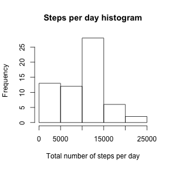
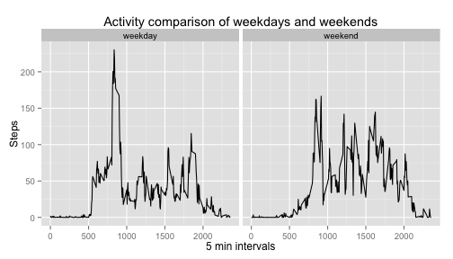

This report is answering questions related to personal step tracking data of an anonymous individual. It is part of a peer assessment part of the coursera course *Reproducable research*. The report is structured into several section. It starts of with the required libraries, details how data is being loaded and cleaned and subsequently answers the questions of the assessment.

## Required libraries

To preprocess the data the following libraries are being used and have to be loaded before any further processing.

```r
library(lubridate)
library(dplyr)
library(ggplot2)
```

## Loading and preprocessing the data
The source data is the file *activity.zip* in the root folder of the git repository containing the report. It contains tracking data for steps that are measured at 5 min intervals. The data covers October and November, 2012 for a single individual.

For loading it the zip file is being unzip and read by using the *read.cvs()* function:


```r
activitySourceCompressedFile <- 'activity.zip'
activityFile <- 'activity.csv'
columnNames <- c("steps","date","interval")
columnClasses <- c("integer","character","integer")
activityData <- read.table(unz(activitySourceCompressedFile, activityFile), 
                           stringsAsFactors = FALSE, 
                           sep = ",", 
                           na.strings = "NA", 
                           col.names = columnNames, 
                           skip = 1, 
                           colClasses = columnClasses)
```
The string *NA* is used to denote missing values.

The third column containing the date when the activity was tracked is parsed by the lubridate library function *ymd* and converted into *POSIXct*.

```r
activityData$date <- ymd(activityData$date)
```

The result of the loading and cleaning the data is the *activityData* data frame consisting of three columns:

column name | data type
------------|-----------
steps       | integer 
date        | POSIXct
interval    | integer

## What is mean total number of steps taken per day?
To find out what the mean total number of steps taken per day are, steps are summed up first by using the tapply function:

```r
stepsPerDay <- with(activityData, tapply(steps, date, sum, na.rm = TRUE))
```

The following histogram gives an impression on how the data is distributed:

```r
hist(stepsPerDay, main = "Steps per day histogram", xlab = "Total number of steps per day")
```

 

The calculation of the mean total number of steps is done by the *mean* function:

```r
meanStepsPerDay <- mean(stepsPerDay)
meanStepsPerDay 
```

```
## [1] 9354.23
```

The median is being calculated by applying the *median* function:

```r
medianStepsPerDay <- median(stepsPerDay)
medianStepsPerDay 
```

```
## [1] 10395
```

## What is the average daily activity pattern?

To be able to understand the daily activity pattern the data is being summed per interval and averaged across all days. Missing values are ignored.


```r
stepsPerInterval <- activityData %>% 
                    na.omit() %>% 
                    group_by(interval) %>%
                    summarize (mean_steps = mean(steps)) %>% 
                    arrange(interval)
```

The following graph show the resulting daily activity pattern. 

```r
plot(stepsPerInterval,type = "l", 
     main = "Daily activity pattern", 
     xlab = "Intervals", 
     ylab = "Mean steps per interval across all days")
```

 

The pattern seems to align with what one could expect from an individual with a normal sleep / activity rythm. Throughout night ours the activity is usually low or there is no activity. In the morning hours there is an increased activity (here the hours 7am till 9am) which e.g. could hint at going to work by foot.

The maximum average number of steps falls in between 8:35 and 8:40 and is about 206 steps:

```r
max(stepsPerInterval$mean_steps)
```

```
## [1] 206.1698
```

```r
stepsPerInterval[which.max(stepsPerInterval$mean_steps),1]
```

```
## Source: local data frame [1 x 1]
## 
##   interval
## 1      835
```


## Inputing missing values

The source data contains missing values which could introduce a bias to calculations or summaries of the data.

The total number of missing values for step values across the data set is 2304 which is about 13,11% of the whole data set.

```r
missingValues <- sum(is.na(activityData$steps))
missingValues
```

```
## [1] 2304
```

```r
percentageMissingValues <- missingValues / length(activityData[,1])
percentageMissingValues
```

```
## [1] 0.1311475
```

There are several strategies to fill in a missing value and the filler value could for example be based on  

* the mean value for a given interval based on all days
* the median value for a given interval based on all days
* the mean/median value for a given interval based on the day to which the interval belongs

For creating a repaired activity data set I am using the strategy of applying the mean value for a given interval based on all days to missing values.

This requires to create a function that looks up the correct value based on the already existing *stepsPerInterval* data frame. The function is than applied to the *activityData* data frame to create repaired version of it. The dplyr library is used to apply this row wise look up.

```r
replaceIfMissing <- function(value, targetInterval, lookup) {
    if(is.na(value)) {  
        as.integer(filter(lookup, interval == targetInterval)[,2]$mean_steps)
    } else {
        value
    }   
}
activityDataRepaired <- activityData %>% 
                        rowwise() %>% 
                        mutate(steps = replaceIfMissing(steps,interval,stepsPerInterval))
```

To see the effect of filling in missing values I am comparing the mean and median values for the total number of steps per day with the ones when missing values were excluded from the calculation.

To find out what the mean total number of steps taken per day in the repaired data set are, steps are summed up first by using the tapply function:

```r
stepsPerDayRepaired <- with(activityDataRepaired, tapply(steps, date, sum, na.rm = TRUE))
```

The following histogram gives an impression on how the data is distributed in the repaired data set:

```r
hist(stepsPerDayRepaired, main = "Steps per day histogram - Repaired data", xlab = "Total number of steps per day")
```

 

The calculation of the mean and median total numbers follows:

```r
meanStepsPerDayRepaired <- mean(stepsPerDayRepaired)
medianStepsPerDayRepaired <- median(stepsPerDayRepaired)
```

The mean values are about 14.92% higher in the repaired data set whereas the median values only differ by about 2.37%:

```r
formatAsPercentage <- function(numericValue) {
    paste(round((numericValue) * 100, 2), "%", sep="")
}
formatAsPercentage((meanStepsPerDayRepaired / meanStepsPerDay) - 1)
```

```
## [1] "14.92%"
```

```r
formatAsPercentage((medianStepsPerDayRepaired / medianStepsPerDay) - 1)
```

```
## [1] "2.37%"
```

## Are there differences in activity patterns between weekdays and weekends?

To investigate if there is a difference in the activity patterns between weekdays and weekends the intervals first have to be classified as either being weekend or weekday intervals. A new factor column is added to *activityDataRepaired* to indicate this.


```r
isWeekend <- function(dateValue) {
    if(wday(dateValue) %in% c(1,7)) {
        "weekend"
    } else {
        "weekday"
    }
}
activityDataRepaired$week <- sapply(activityDataRepaired$date, isWeekend)
activityDataRepaired$week <- factor(activityDataRepaired$week)
```

A panel plot shows that the maximum activity during the weekend is lower than during weekdays for the given data set and individual.


```r
qplot(interval, steps, data = activityDataRepaired, 
      geom = c("line"), 
      facets = . ~ week, 
      stat = "summary", 
      fun.y = "mean", 
      ylab = "Steps", 
      xlab = "5 min intervals", 
      main = "Activity comparison of weekdays and weekends")
```

 

In the morning there is a higher activity during weekdays which could hint at the individual going to work. In the afternoon there is a second spike in activity which could be the way home. For all hours starting after noon there is a higher average activity during the weekend. The main activity period also lasts longer than during the week.
